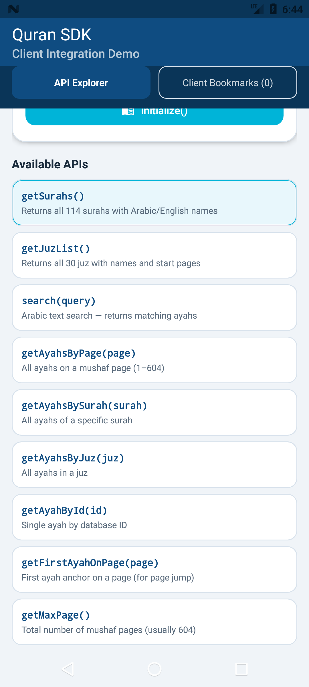
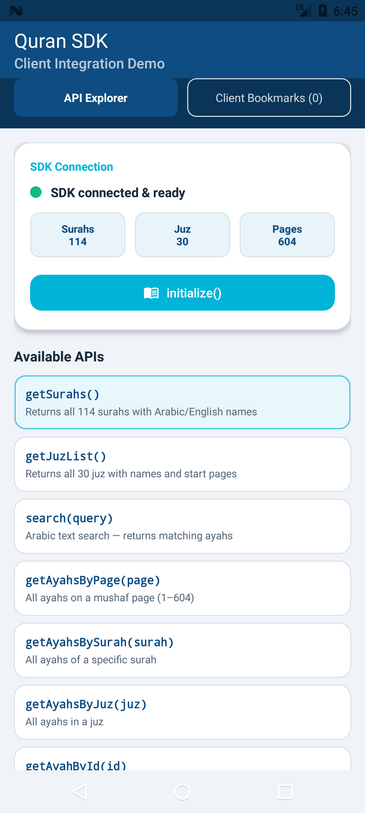
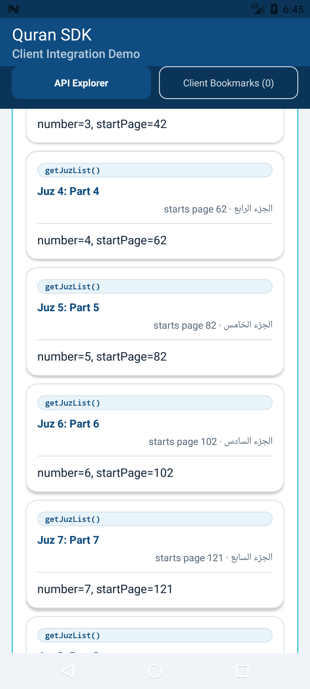

# تقرير اختبار Android SDK

**التاريخ:** 2026-09-17  
**البيئة:** macOS (Apple Silicon)، JDK 17 (Temurin)، AGP 8.13، محاكيان arm64 بدون واجهة.

## النتيجة

| المجموعة | العدد | Android 7.0 (API 24) | Android 15 (API 35) |
|---|---|---|---|
| اختبارات الوحدة (JVM) | 20 | ✅ 20/20 (لا تحتاج جهازاً) | |
| اختبارات الجهاز | 17 | ✅ 17/17 | ✅ 17/17 |
| Lint (`:quran-sdk:lintDebug`) | — | ✅ | |
| بناء التطبيق التجريبي (`minSdk 24`) | — | ✅ ويعمل على الجهاز | |

## ما تغطيه الاختبارات

**اختبارات الوحدة** (`quran-sdk/src/test`):
- `ArabicNormalizerTest` (6): التشكيل، والهمزات، والتطويل، والأقواس، والأرقام العربية.
- `QuranDataMapperTest` (9): على `quran.json` الحقيقي:
  - الأعداد، وبدايات السور والأجزاء، والحقول المكتملة، وعدم وجود مسافات دخيلة.
  - رفض البيانات الناقصة (جزء مفقود، سورة مفقودة، آية مفقودة).
- `QuranRepositorySearchTest` (5): المطابقة بدون تشكيل، والترتيب، وشرط تطابق كل الكلمات، والحد الأقصى، والتخزين المؤقت.

**اختبارات الجهاز** (`quran-sdk/src/androidTest`):
- `ImportTest` (7):
  - الاستيراد الأول، ثم تجاهل الاستدعاء الثاني.
  - إعادة الاستيراد عند تغيّر نسخة البيانات أو نقص الجداول.
  - انقطاع أثناء الاستيراد الأول لا يترك شيئاً، وانقطاع أثناء إعادة الاستيراد يحفظ البيانات السابقة.
  - رفض البيانات غير الصالحة دون المساس بالقاعدة.
  - صحة بدايات الأجزاء.
- `QuranApiContractTest` (6): كل دوال `QuranApi` بقيم معروفة، ومنها الآية 746 على صفحة 121 (طبعة 1405) والبحث عن «فادارأتم».
- `QuranPageViewSmokeTest` (2):
  - `goToPage(50)` مباشرة بعد `bind()` يفتح الصفحة 50.
  - النقر يستدعي `onAyahTapped` بآية من نفس الصفحة.
  - السحب لليمين ينقل للصفحة التالية، ولليسار للسابقة.
- `PerformanceTest` (2): أرقام الأداء أدناه.

## الأداء (على المحاكي)

| المقياس | API 24 | API 35 |
|---|---|---|
| أول استيراد للبيانات (`initialize` بعد التثبيت) | 106 ms | 159 ms |
| `initialize` في التشغيلات اللاحقة | 0 ms | 1 ms |
| أول بحث (يبني الفهرس) | 127 ms | 250 ms |
| البحث بعد التخزين المؤقت | 3 ms | 22 ms |
| ذاكرة Java: قبل ← بعد تقليب 50 صفحة | 9 ← 10 MB | 5 ← 5 MB |
| الذاكرة الأصلية (native): قبل ← بعد | 22 ← 24 MB | 21 ← 26 MB |

لا يوجد تسرب ملحوظ في الذاكرة. الأرقام من محاكيات، فتُعتبر تقريبية، والأجهزة الحقيقية الضعيفة تحتاج قياساً مستقلاً.

## أخطاء وُجدت وأُصلحت في هذه المرحلة

| # | الخطأ | الإصلاح |
|---|---|---|
| F4 | `getJuzList()` يرجع صفحة خاطئة لـ28 جزءاً من 30 | `QuranDataMapper` يحسب بداية الجزء من آياته |
| F9 | الاستيراد بدون transaction وبدون نسخة بيانات | `withTransaction` + `DATA_VERSION = 2` + فحص اكتمال الجداول + `Mutex` |
| F10 | `chapterId ?: 0` | `InvalidQuranDataException` (واجهة عامة جديدة في `api/`) |
| F11 | التطبيق التجريبي يتطلب أندرويد 15 | `minSdk 24`، ونقل الأيقونات المتكيفة إلى `mipmap-anydpi-v26` |
| F13 | البناء يفشل على جهاز لغته عربية | تثبيت `user.language=en` في `gradle.properties` |
| جديد | `goToPage()` بعد `bind()` مباشرة يُتجاهَل، فتفتح الصفحة 1 دائماً | `QuranPageView` يحفظ الصفحة المطلوبة ويطبقها عند جاهزية الـadapter |
| جديد | حزمة الاختبار تستهدف SDK 24، فيظهر تحذير «تطبيق قديم» على أندرويد 15 ويسرق التركيز | `testOptions.targetSdk = 36` |

## ملاحظات
- **رسائل تعطل في سجل API 24:** `SIGSEGV` من عمليات `uid=2000` (مستخدم shell، أي أدوات adb) عند انتهاء الاختبارات. خلل معروف في محاكي API 24، وليست من التطبيق أو الـSDK.
- **فشل مؤقت في اختبار السحب على API 24:** كان الاختبار يرسل السحبة الثانية قبل انتهاء حركة الأولى. صار ينتظر توقف الصفحة تماماً، ونجح بعدها 3 مرات متتالية ثم في التشغيل الكامل.

## لقطات من التطبيق التجريبي (API 24)

| قبل التهيئة | بعد التهيئة | `getJuzList()` بعد الإصلاح |
|---|---|---|
|  |  |  |

## إعادة التشغيل
```bash
bash tools/setup_android_env.sh      # مرة واحدة: JDK 17 + Android SDK + محاكيان
cd quranapp-main
export JAVA_HOME=~/tools/jdk-17/Contents/Home ANDROID_HOME=~/Library/Android/sdk
bash gradlew :quran-sdk:testDebugUnitTest :quran-sdk:lintDebug :app:assembleDebug
~/Library/Android/sdk/emulator/emulator -avd api35 -no-window &
bash gradlew :quran-sdk:connectedDebugAndroidTest
```
`gradlew` يُشغَّل عبر `bash` لأن الملف وصل عبر WhatsApp ويحمل علامة الحجر (quarantine) في macOS.
